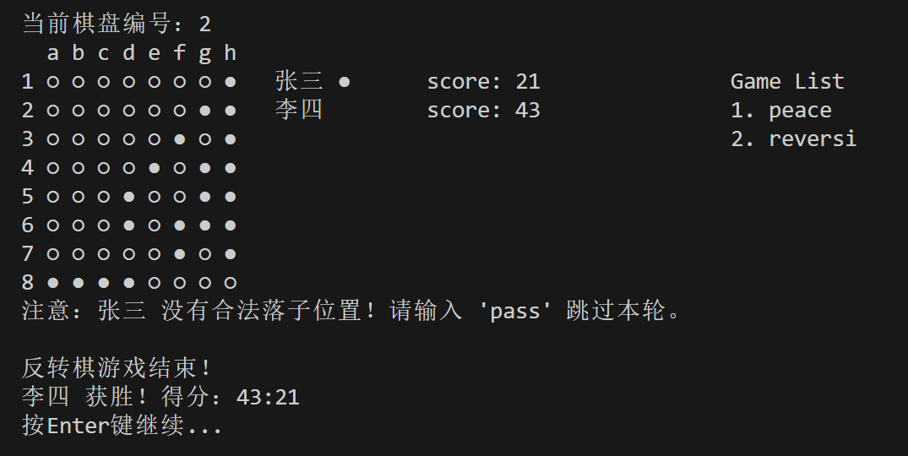

# 棋盘游戏项目
#### 23301170011 王一涵
这是一个基于Java的棋盘游戏项目，支持两种游戏模式：普通棋盘模式和黑白棋（反转棋）模式。

## 项目结构

- `Reversegame.java`: 程序入口，初始化游戏环境
- `Game.java`: 游戏核心类，负责管理多个棋盘和游戏流程
- `Board.java`: 普通棋盘实现
- `ReverseBoard.java`: 黑白棋（反转棋）棋盘实现，继承自Board类
- `Player.java`: 玩家类，管理玩家信息和分数
- `Piece.java`: 棋子枚举类，定义棋子类型和显示符号

## 功能特点

1. **多棋盘管理**：系统可以同时管理多个不同类型的棋盘，玩家可以在游戏过程中自由切换
2. **棋盘类型**：
   - 普通棋盘（peace）：基本的落子规则
   - 黑白棋棋盘（reversi）：实现经典黑白棋规则，包括翻转对方棋子的功能
3. **动态添加游戏**：可以在游戏过程中随时添加新的棋盘（输入peace或reversi）
4. **棋盘切换**：输入棋盘编号可以在不同棋盘间切换
5. **得分计算**：自动计算并显示玩家在黑白棋中的得分
6. **合法落子提示**：在黑白棋模式下显示所有合法落子位置
7. **游戏结束处理**：检测游戏结束条件并显示结果

## 代码设计

1. **继承与多态**：使用继承关系实现不同棋盘类型，基类Board提供基本功能，子类ReverseBoard扩展特殊规则
2. **枚举类型**：使用Piece枚举定义棋子类型，提高代码可读性
3. **面向对象设计**：通过Player、Board、Game等类的组合实现功能解耦
4. **动态管理**：使用List容器管理多个棋盘实例
5. **交互设计**：实现清晰的用户界面，提供游戏状态显示和操作提示

## 使用方法

1. 运行`Reversegame`类启动游戏
2. 输入落子位置（如"1a"表示第1行a列）
3. 输入棋盘编号（如"1"、"2"）切换棋盘
4. 输入"peace"或"reversi"添加新游戏
5. 输入"pass"在黑白棋中跳过当前回合（仅当无合法落子时可用）
6. 输入"quit"退出游戏

## 黑白棋规则

1. 新落下的棋子必须与已有同色棋子之间夹住连续的对手棋子
2. 夹住的对手棋子会被翻转为自己的颜色
3. 必须至少翻转一枚对手棋子才能落子
4. 如果玩家没有合法落子位置，可以跳过回合
5. 当双方都无法落子或棋盘已满时，游戏结束
6. 棋盘上棋子数量最多的玩家获胜

## 代码详细解释

### 1. 棋子类 (Piece.java)

```java
public enum Piece {
    BLACK("●"), WHITE("○"), EMPTY("·");
    private final String symbol;
    Piece(String symbol) { this.symbol = symbol; }
    public String getSymbol() { return symbol; }
}
```

这是一个枚举类，定义了三种棋子类型：
1. 定义了BLACK（黑棋）、WHITE（白棋）和EMPTY（空位）三种状态
2. 每种状态关联一个字符串符号（●、○、·）用于显示
3. 构造函数接收符号并存储
4. getSymbol()方法用于获取棋子的显示符号

### 2. 玩家类 (Player.java)

```java
public class Player {
    private final String name;
    private final Piece pieceType; 
    private int score = 2;

    public Player(String name, Piece pieceType) {
        this.name = name;
        this.pieceType = pieceType;
    }

    public String getName() { 
        return name; 
    }

    public Piece getPieceType() { 
        return pieceType; 
    }

    public int getScore() {
        return score;
    }

    public void setScore(int score) {
        this.score = score;
    }
}
```

玩家类管理玩家信息：
1. 包含玩家姓名、使用的棋子类型和得分
2. 构造函数初始化玩家姓名和棋子类型
3. 提供getter方法获取玩家姓名和棋子类型
4. 提供getter/setter方法管理玩家得分
5. 初始分数设为2，对应黑白棋初始状态下的棋子数量

### 3. 棋盘基类 (Board.java)

```java
public class Board {
    protected final int SIZE = 8; // 棋盘大小
    protected final Piece[][] grid; // 棋盘二维数组
    protected Game game; // 游戏引用

    public Board() {
        grid = new Piece[SIZE][SIZE]; // 初始化棋盘数组
        initializeBoard(); // 初始化棋盘
    }
    
    // 设置游戏引用
    public void setGameList(Game game) {
        this.game = game;
    }

    // 初始化棋盘
    protected void initializeBoard() {
        // 将所有位置设为空
        for (int row = 0; row < SIZE; row++) {
            for (int col = 0; col < SIZE; col++) {
                grid[row][col] = Piece.EMPTY;
            }
        }
        // 设置初始棋子位置
        grid[3][4] = Piece.BLACK; // 4E
        grid[4][3] = Piece.BLACK; // 5D
        grid[3][3] = Piece.WHITE; // 4D
        grid[4][4] = Piece.WHITE; // 5E
    }

    // 放置棋子的方法
    public boolean placePiece(int row, int col, Piece piece) {
        if (isValidPosition(row, col) && grid[row][col] == Piece.EMPTY) {
            grid[row][col] = piece;
            return true;
        }
        return false;
    }

    // 检查位置是否有效
    protected boolean isValidPosition(int row, int col) {
        return row >= 0 && row < SIZE && col >= 0 && col < SIZE;
    }

    // 检查棋盘是否已满
    public boolean isFull() {
        for (Piece[] row : grid) {
            for (Piece cell : row) {
                if (cell == Piece.EMPTY) return false;
            }
        }
        return true;
    }

    // 检查游戏结束
    public void checkGameEnd(Player player1, Player player2) {
        if (isFull()) {
            System.out.println("棋盘已满，游戏结束！");
            // 计算棋子数量并显示结果
            // ...
        }
    }

    // 显示棋盘
    public void display(Player player1, Player player2, Player currentPlayer, int boardNumber) {
        clearScreen();
        // 显示棋盘边框和内容
        // 显示玩家信息和游戏列表
        // ...
    }
    
    // 获取游戏列表
    protected List<String[]> getRunningGamesList() {
        if (game != null) {
            return game.getGameTypeList();
        }
        List<String[]> gamesList = new ArrayList<>();
        gamesList.add(new String[]{"1", "peace"});
        return gamesList;
    }

    // 清屏方法
    protected void clearScreen() {
        // ...
    }
}
```

棋盘基类实现基本功能：
1. 定义8x8大小的棋盘和二维数组存储
2. 构造函数初始化棋盘并设置初始棋子
3. 提供放置棋子的方法，要求位置有效且为空
4. 检查位置是否在棋盘范围内
5. 检查棋盘是否已满（游戏结束条件之一）
6. 显示棋盘状态，包括棋子、玩家信息和游戏列表
7. 获取当前运行的游戏列表
8. 提供清屏方法美化界面

### 4. 黑白棋棋盘类 (ReverseBoard.java)

```java
public class ReverseBoard extends Board {
    
    public ReverseBoard() {
        super();
    }
    
    // 落子并翻转对手棋子
    public boolean canPlaceAndFlip(int row, int col, Piece piece, Player player) {
        if (!isValidPosition(row, col) || grid[row][col] != Piece.EMPTY) {
            return false;
        }

        boolean canFlip = false;
        Piece opponentPiece = (piece == Piece.BLACK) ? Piece.WHITE : Piece.BLACK;
        
        // 8个方向的位移
        int[][] directions = {
            {-1, 0}, {1, 0}, {0, -1}, {0, 1},
            {-1, -1}, {-1, 1}, {1, -1}, {1, 1}
        };
        
        // 检查每个方向
        for (int[] direction : directions) {
            int dRow = direction[0], dCol = direction[1];
            int currentRow = row + dRow, currentCol = col + dCol;
            boolean hasOpponentPieceBetween = false;
            int directionFlipCount = 0;

            // 沿方向查找对手棋子
            while (isValidPosition(currentRow, currentCol) && 
                   grid[currentRow][currentCol] == opponentPiece) {
                hasOpponentPieceBetween = true;
                directionFlipCount++;
                currentRow += dRow;
                currentCol += dCol;
            }

            // 确认该方向能形成夹击
            if (hasOpponentPieceBetween && 
                isValidPosition(currentRow, currentCol) && 
                grid[currentRow][currentCol] == piece) {
                
                canFlip = true;
                
                // 回溯翻转对手棋子
                currentRow -= dRow;
                currentCol -= dCol;
                while (currentRow != row || currentCol != col) {
                    grid[currentRow][currentCol] = piece;
                    currentRow -= dRow;
                    currentCol -= dCol;
                }
            }
        }
        
        // 更新玩家得分
        if (canFlip) {
            updatePlayerScore(player);
        }
        
        return canFlip;
    }
    
    // 更新玩家得分
    private void updatePlayerScore(Player player) {
        Piece piece = player.getPieceType();
        int count = 0;
        
        // 统计棋盘上玩家棋子数量
        for (int row = 0; row < SIZE; row++) {
            for (int col = 0; col < SIZE; col++) {
                if (grid[row][col] == piece) {
                    count++;
                }
            }
        }
        
        player.setScore(count);
    }
    
    // 重写落子方法
    @Override
    public boolean placePiece(int row, int col, Piece piece) {
        Player player = (piece == Piece.BLACK) ? game.getPlayer1() : game.getPlayer2();
        
        if (canPlaceAndFlip(row, col, piece, player)) {
            grid[row][col] = piece;
            
            // 更新双方得分
            updatePlayerScore(game.getPlayer1());
            updatePlayerScore(game.getPlayer2());
            
            return true;
        }
        return false;
    }
    
    // 判断位置是否为合法落子
    public boolean isValidMove(int row, int col, Piece piece) {
        // 与canPlaceAndFlip类似的判断逻辑，但不修改棋盘
        // ...
    }
    
    // 判断玩家是否有合法落子
    public boolean hasValidMove(Piece piece) {
        for (int row = 0; row < grid.length; row++) {
            for (int col = 0; col < grid[row].length; col++) {
                if (grid[row][col] == Piece.EMPTY && isValidMove(row, col, piece)) {
                    return true;
                }
            }
        }
        return false;
    }
    
    // 判断是否允许跳过回合
    public boolean canPass(Piece piece) {
        return !hasValidMove(piece);
    }
    
    // 重写显示方法，添加合法落子提示
    @Override
    public void display(Player player1, Player player2, Player currentPlayer, int boardNumber) {
        // 更新双方得分
        updatePlayerScore(player1);
        updatePlayerScore(player2);
        
        clearScreen();
        // 显示棋盘，有效落子位置显示为"+"
        // 显示玩家信息和得分
        // ...
    }
    
    // 判断游戏是否结束
    public boolean isGameOver() {
        // 判断双方是否都无法落子
        return !hasValidMove(Piece.BLACK) && !hasValidMove(Piece.WHITE);
    }
    
    // 获取游戏结果
    public String getGameResult() {
        // 计算双方得分并返回结果
        // ...
    }
}
```

黑白棋棋盘类扩展了基本棋盘：
1. 继承基本棋盘类，复用其功能
2. 实现黑白棋的核心算法：canPlaceAndFlip方法
   - 检查八个方向是否能形成夹击
   - 找到满足条件的方向后翻转对手棋子
3. 重写placePiece方法，增加翻转规则判断
4. 实现isValidMove方法检查落子合法性
5. 实现hasValidMove方法判断玩家是否有合法落子
6. 实现canPass方法判断是否可以跳过回合
7. 重写display方法，显示合法落子位置的提示
8. 添加游戏结束判断和结果计算
9. 实现得分计算功能，统计棋盘上各颜色棋子数量

### 5. 游戏管理类 (Game.java)

```java
public class Game {
    // 棋盘列表、回合管理和游戏类型
    private final List<Board> boards;
    private final List<Integer> boardTurns;
    private final List<String> gameTypes;
    private int currentBoardIndex = 0;

    private final Player player1;
    private final Player player2;
    private final Scanner scanner;

    public Game(Player player1, Player player2) {
        boards = new ArrayList<>();
        boardTurns = new ArrayList<>();
        gameTypes = new ArrayList<>();
        
        // 初始化两个棋盘
        boards.add(new Board());  // 普通棋盘
        boardTurns.add(0);
        gameTypes.add("peace");
        
        boards.add(new ReverseBoard());  // 反转棋盘
        boardTurns.add(0);
        gameTypes.add("reversi");
        
        this.player1 = player1;
        this.player2 = player2;
        this.scanner = new Scanner(System.in);
        
        updateBoardsGameList();
    }
    
    // 更新所有棋盘的游戏列表引用
    private void updateBoardsGameList() {
        for (Board board : boards) {
            board.setGameList(this);
        }
    }
    
    // 获取游戏类型列表
    public List<String[]> getGameTypeList() {
        List<String[]> result = new ArrayList<>();
        for (int i = 0; i < boards.size(); i++) {
            result.add(new String[]{String.valueOf(i + 1), gameTypes.get(i)});
        }
        return result;
    }

    // 游戏主循环
    public void start() {
        boolean running = true;
        boolean allGameEndedNotified = false;
        
        while (running) {
            // 获取当前棋盘和玩家
            Board currentBoard = boards.get(currentBoardIndex);
            Player currentPlayer = (boardTurns.get(currentBoardIndex) == 0) ? player1 : player2;
            
            // 显示棋盘
            currentBoard.display(player1, player2, currentPlayer, currentBoardIndex + 1);
            
            // 检查游戏结束状态
            boolean allEnded = allBoardsFull() || allBoardsGameOver();
            // 显示相应提示
            // ...
            
            // 处理反转棋游戏结束情况
            if (currentBoard instanceof ReverseBoard && ((ReverseBoard) currentBoard).isGameOver()) {
                // 提示用户并切换到下一个可用棋盘
                // ...
                continue;
            }
            
            // 获取用户输入
            System.out.print("请玩家[" + currentPlayer.getName() + "]输入落子位置、棋盘编号，或添加新游戏(peace/reversi)，或输入 quit 退出");
            // 如果当前是反转棋且无合法落子，提示pass选项
            // ...
            
            String input = scanner.nextLine().trim();

            // 处理各种输入情况：
            // 1. 退出游戏(quit)
            // 2. 跳过回合(pass)
            // 3. 添加新游戏(peace/reversi)
            // 4. 切换棋盘(数字)
            // 5. 落子位置(如1a)
            // ...
            
            // 落子后更新棋盘状态和回合
            // ...
        }
    }

    // 判断所有棋盘是否已满
    private boolean allBoardsFull() {
        for (Board board : boards) {
            if (!board.isFull()) {
                return false;
            }
        }
        return true;
    }

    // 判断所有棋盘游戏是否结束
    private boolean allBoardsGameOver() {
        for (Board board : boards) {
            if (board instanceof ReverseBoard) {
                if (!((ReverseBoard) board).isGameOver()) {
                    return false;
                }
            } else {
                if (!board.isFull()) {
                    return false;
                }
            }
        }
        return true;
    }

    // 获取玩家
    public Player getPlayer1() {
        return player1;
    }
    
    public Player getPlayer2() {
        return player2;
    }
    
    // 获取当前棋盘索引
    public int getCurrentBoardIndex() {
        return currentBoardIndex;
    }
}
```

游戏管理类实现核心控制逻辑：
1. 使用列表管理多个棋盘、回合状态和游戏类型
2. 构造函数初始化两种棋盘类型（和平棋盘和反转棋盘）
3. 实现start方法作为游戏主循环，处理用户交互
4. 支持多种输入命令：
   - 落子位置（如1a）
   - 棋盘切换（数字）
   - 添加新游戏（peace/reversi）
   - 跳过回合（pass，仅在无法落子时有效）
   - 退出游戏（quit）
5. 维护游戏状态，处理棋盘切换和游戏结束逻辑
6. 检测所有棋盘是否已满或游戏结束
7. 提供玩家信息和当前棋盘索引的访问方法

### 6. 游戏入口类 (Reversegame.java)

```java
public class Reversegame {
    public static void main(String[] args) {
        // 初始化两个玩家
        Player player1 = new Player("张三", Piece.BLACK);
        Player player2 = new Player("李四", Piece.WHITE);
        
        // 创建游戏实例
        Game game = new Game(player1, player2);
        
        // 启动游戏
        game.start();
    }
}
```

游戏入口类提供程序的启动点：
1. main方法是程序的入口
2. 创建两个玩家实例，分别使用黑色和白色棋子
3. 创建Game类的实例
4. 调用game.start()方法启动游戏主循环
## 运行结果与测试
- **测试**
```
3d
3c
3b
2b
1b
1a
4c
1c
2c
2d
1d
1e
2a
3a
5f
2e
1f
1g
pass

2f
pass

3e
pass

5b
4b
5a
4a
5c
6a
7a
pass

4f
3f
3g
2g
2h
1h
3h
4h
4g
pass

5g
6c
6d
5h
6b
6e
6f
6g
6h
7b
8b
8a
7c
8c
pass

7d
7e
7f
8f
7h
7g
8g
8h
8d
8e
```


- 正常显示棋盘
·
<br>
##### reverse模式
 - 正确显示合法落子位置，没有合法落子位置时，提示用户输入pass
 
 <br>
 - 棋盘下满时，返回，并显示得分
 
 <br>
 - 翻转、切换棋盘、计分等功能均已测试正确

##### peace模式
  - 棋盘填满时，提示游戏结束
  
##### 添加棋盘
 - 添加新游戏，切换棋盘


